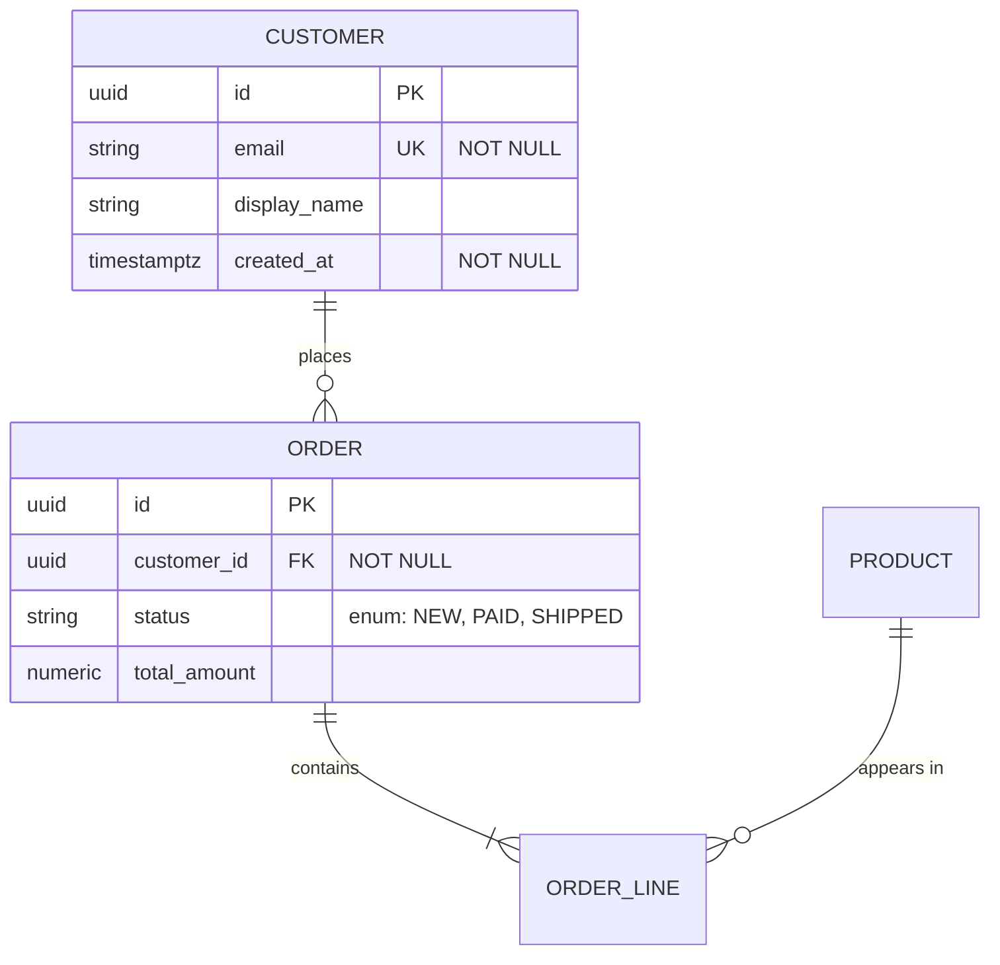

# Spring Boot Spec-Driven Development

## Critical rules

These are the non-negotiables. Everything below elaborates on them:

1. **Docs before code; data model before everything.** Never write an entity,
   migration, service, or controller before the relevant doc reflects it.
2. **No drift.** Docs and code change together, in the same PR. If the code forces
   a model change, fix the doc first.
3. **Greenfield has a hard approval gate.** On a from-scratch project, stop and get
   sign-off on the three docs before scaffolding or writing any code.

## Mental model

This codebase is **docs-first**. Three living documents describe the system and
are the canonical context every ticket reads before any code is touched:

```
docs/context/
├── datamodel.md      # entities + Mermaid E-R diagram (source of truth for the schema)
├── dataflow.md       # how data moves: flows, sequence diagrams, integrations
└── architecture.md   # components, layering, package structure, cross-cutting concerns
```

The code never invents structure on its own. It is derived from and kept
consistent with these docs. When a Jira ticket arrives, the docs are updated
*first* and the implementation follows them. This keeps the system coherent
across many tickets and many sessions: the next ticket starts from an accurate,
diffable description of what already exists rather than re-deriving it from the
code each time.

The order is non-negotiable and exists for a reason: **data model leads.**
Most backend changes are ultimately shaped by the entities and their
relationships. Nailing the E-R model first prevents the common failure mode of
writing services and controllers against a schema that turns out to be wrong.

## When this skill runs in the larger flow

Slot this skill *after* the ticket is understood (the clarify / brainstorm phase)
and *before and around* the planning + TDD coding phase:

```
fetch ticket → clarify/brainstorm → [THIS SKILL: update docs] → plan → TDD implement → review
```

It does not replace the TDD or writing-plans skills — it produces the spec they
implement against. The plan's tasks must cite the updated docs.

---

## First: detect the start state and pick the mode

The same data-model-first ordering applies in every case, but the **source** of
the docs differs. Detect which situation you're in and switch accordingly:

| `docs/context/` exists? | Code exists? | Mode | Where the docs come from |
|---|---|---|---|
| Yes | Yes | **A — Existing project** | Read the docs (they're the source of truth) |
| No | Yes | **Bootstrap** | Reverse-engineer the docs from the current code, then continue as Mode A |
| No | No | **B — Greenfield / init** | **Author the docs from the spec**, get sign-off, scaffold to match, then implement |

The greenfield case is the one people miss: there's no code to read *and* no code
to reverse-engineer, so the docs cannot be derived from the codebase. They are
generated from the requirements themselves. Use **Workflow B** for that.

---

## Workflow A — Existing project (per ticket)

### Step 0 — Load context (always, before anything else)

Read all three docs in `docs/context/` in full. Do not skim. If the docs are
missing but code exists, this is the **bootstrap** case: create them from the
templates in `assets/templates/` by reverse-engineering the current codebase, then
proceed as normal. If both docs and code are missing, stop — this is greenfield; use
**Workflow B** instead. State explicitly which existing entities/flows/components
the ticket touches before changing anything.

### Step 1 — Data model FIRST (datamodel.md + E-R diagram)

Determine whether the ticket introduces, removes, or changes any entity, field,
relationship, constraint, or enum.

- If **yes**: update `datamodel.md` before writing any other doc or code. Update
  the Mermaid `erDiagram` block to reflect the new state, then update the entity
  catalog entries (fields, types, constraints, relationships), then append a row
  to the change log referencing the ticket ID.
- If **no schema change**: state that explicitly ("No data-model change for
  TICKET-123") and move on. Do not edit the diagram for nothing.

The E-R diagram is the authoritative schema. JPA `@Entity` classes must match it
exactly — same entities, same relationships, same cardinality. See
"E-R diagram conventions" below.

### Step 2 — Dataflow (dataflow.md)

Add or update the flow(s) the ticket implements: the trigger (endpoint / event /
schedule), the ordered steps, which components/layers are touched, and the data
in/out. Add or update a Mermaid `sequenceDiagram` for any non-trivial flow.
Record any new external integration (REST client, Kafka topic, queue, cache).

### Step 3 — Architecture (architecture.md)

Update only if the ticket changes structure: a new module/package, a new
cross-cutting concern, a changed boundary, a new external dependency, or a
notable technical decision. Small features inside existing components usually
need no architecture change — say so rather than padding the doc.

### Step 4 — Implement (compose with TDD)

Now hand off to the TDD / writing-plans workflow. Constraints for the
implementation:

- Every JPA entity, repository, DTO, and migration must match `datamodel.md`.
  If implementation reveals the model was wrong, **go back and fix the doc
  first**, then continue. Docs and code never drift.
- Service and controller behavior must match the flow in `dataflow.md`.
- Package placement must follow `architecture.md`.
- Tests come before implementation (red → green → refactor). Reference the
  relevant doc section in the plan task for each unit of work.

See `references/commands.md` for the concrete test/verify and migration commands
(Maven and Gradle variants).

### Step 5 — Sync check + commit

Before declaring done, verify the three docs and the code agree. Commit the doc
changes **in the same PR** as the code so a reviewer sees the spec and the
implementation together. A PR that changes the schema without updating
`datamodel.md` is incomplete.

---

## Workflow B — Greenfield / new project init

Use this when there is no `docs/context/` **and** no code. The docs are authored
from the spec, not read from anything. The kickoff input is usually a Jira epic
or an initial requirements doc rather than one small ticket — treat that whole
spec as the seed.

The ordering is the same (data model leads), but two things change: the docs are
**generated**, and because everything downstream rests on a model invented in one
pass, there is a **mandatory human-approval gate** before any scaffolding or code.

### Step 0 — Anchor on the spec

Read the epic / requirements doc in full. List the use cases, the nouns
(candidate entities), and any stated constraints. If the spec is thin, this is
the moment to run Superpowers' brainstorming with the person — do not invent
requirements silently.

### Step 1 — Create the docs skeleton

Create `docs/context/` and the three files from the templates in
`assets/templates/` as empty skeletons. Nothing is filled in yet; this just
establishes the canonical locations.

### Step 2 — Author the data model FIRST (datamodel.md + E-R diagram)

This is the genuinely generative step: derive entities, relationships, enums, and
key fields **from the requirements** and write `datamodel.md` with the Mermaid
`erDiagram`. This is a *proposal*, not a finished schema.

### Step 3 — Author dataflow.md and architecture.md

Write `dataflow.md` from the use cases in the spec (one flow per primary use
case, with sequence diagrams for the non-trivial ones). Write `architecture.md` —
this is heavier on greenfield because here you actually **choose** the package
layout, layering, persistence, and key tech decisions, and record the rationale.

### Step 4 — HUMAN APPROVAL GATE (do not skip)

Stop and present the three docs for review before writing any code. The ER model,
the flows, and the architecture are the contract everything else is built on; a
wrong model here pours the foundation crooked. Get explicit sign-off (or iterate)
before proceeding. This is where Superpowers' brainstorming/design phase earns
its keep — treat the approved docs as the agreed design.

### Step 5 — Scaffold the project to match architecture.md

Only after approval: generate the Spring Boot skeleton (Spring Initializr or
equivalent) so the build file, base packages, and config **mirror what
`architecture.md` says** — the docs drive the scaffold, never the reverse. Create
the base package structure and the initial entities from `datamodel.md` (with the
matching migration), but no business logic yet. See `references/commands.md` for
the Spring Initializr command and migration-file convention.

### Step 6 — Implement feature by feature via TDD

Now switch to the normal per-feature loop (Workflow A's Step 4): pick a use case,
hand off to the TDD / writing-plans skills, and build it grounded in the
now-existing docs. From here on, every subsequent ticket runs as **Workflow A**.

---

## E-R diagram conventions

Use a Mermaid `erDiagram` inside `datamodel.md`. It renders in GitHub, Jira, and
IDEs and is plain-text diffable in git, so the schema's history lives in version
control alongside the code.

- One block per bounded context if the model is large; otherwise one block.
- Entity names match the JPA `@Entity` class name (PascalCase).
- Use Mermaid relationship syntax for cardinality:
  `||--o{` (one-to-many), `}o--o{` (many-to-many), `||--||` (one-to-one).
- List key attributes with their DB type and the constraint (PK, FK, UK, NN).
- Document the Java type mapping in the entity catalog table, not the diagram.

**Example block:**



Each `erDiagram` entity maps to one `@Entity`; each relationship maps to a JPA
association (`@ManyToOne`, `@OneToMany`, `@ManyToMany`) with the matching
cardinality. Enums in the diagram map to Java enums persisted with
`@Enumerated(EnumType.STRING)`.

---

## Document templates

The canonical structure for each doc lives in `assets/templates/`. When creating
a doc from scratch, copy the matching template so every ticket finds information
in the same place:

- `assets/templates/datamodel.md` — overview, ER diagram, entity catalog, enums, change log
- `assets/templates/dataflow.md` — flows, sequence diagrams, external integrations
- `assets/templates/architecture.md` — context, component map, layering, cross-cutting concerns, deployment view

Read and copy the relevant template rather than reproducing its structure from
memory, so the headings stay identical across the codebase.

---

## Guardrails

- **Docs before code, data model before everything.** If you catch yourself
  writing an entity or migration before `datamodel.md` reflects it, stop and
  update the doc.
- **No silent drift.** Code and docs change together, in the same PR. If the
  implementation forces a model change, the doc is corrected first.
- **Reference, don't restate.** Code comments and PR descriptions point to the
  relevant doc section rather than re-explaining the schema.
- **Skip cleanly.** If a ticket genuinely needs no model / flow / architecture
  change, say so explicitly per doc instead of editing it pointlessly.
- **Bootstrap honestly.** If the docs don't exist, build them from the current
  code first and flag that they're a reverse-engineered baseline to be reviewed.

---

## Examples

**Example 1 — Per-ticket change (Workflow A)**
User says: "Implement TICKET-214: add a discount code to orders."
Actions:
1. Detect start state: `docs/context/` and code exist → Workflow A.
2. Step 0: read all three docs; note this touches the `Order` entity and the checkout flow.
3. Step 1: schema change → update the `erDiagram` and entity catalog in `datamodel.md`, add a change-log row for TICKET-214.
4. Step 2: update the checkout flow in `dataflow.md`.
5. Step 3: no structural change → state "No architecture change for TICKET-214."
6. Step 4–5: hand off to TDD; commit docs + code in one PR.
Result: a PR containing the updated docs, a migration, the entity/DTO/service/test changes — all consistent.

**Example 2 — From-scratch project (Workflow B)**
User says: "Bootstrap a new orders service from this epic."
Actions:
1. Detect start state: no docs, no code → Workflow B.
2. Anchor on the epic; create `docs/context/` skeletons from `assets/templates/`.
3. Author `datamodel.md` (with ER diagram), then `dataflow.md` and `architecture.md`, from the requirements.
4. **Stop at the approval gate** and present the three docs for sign-off.
5. After approval: scaffold the Spring Boot project to match `architecture.md`, then implement feature by feature via TDD.
Result: an approved spec plus a scaffold that matches it, ready for per-ticket work.

---

## Troubleshooting

**Docs and code disagree (drift).**
Cause: code was changed without updating the docs (or vice versa).
Solution: treat `datamodel.md` as authoritative for schema; reconcile the doc first, then the code, and commit both together. A schema-changing PR without a `datamodel.md` change is incomplete.

**ER diagram doesn't render.**
Cause: invalid Mermaid `erDiagram` syntax (often a malformed relationship or attribute line).
Solution: check relationship tokens (`||--o{`, `}o--o{`, `||--||`) and that each entity block lists `type name CONSTRAINT`. Preview in a Mermaid-aware viewer before committing.

**Skill activated on an infra-only ticket.**
Cause: ticket is pure Terraform/K8s/CI with no Spring Boot change.
Solution: this skill is not for those — defer to the Terraform/K8s/Actions skills. Per its description it should not trigger here; if it keeps doing so, tighten the negative trigger.

**Greenfield run started coding before approval.**
Cause: the Workflow B approval gate (Step 4) was skipped.
Solution: stop, present the three docs, get sign-off, and only then scaffold. The gate is mandatory because the whole build rests on a model invented in one pass.
