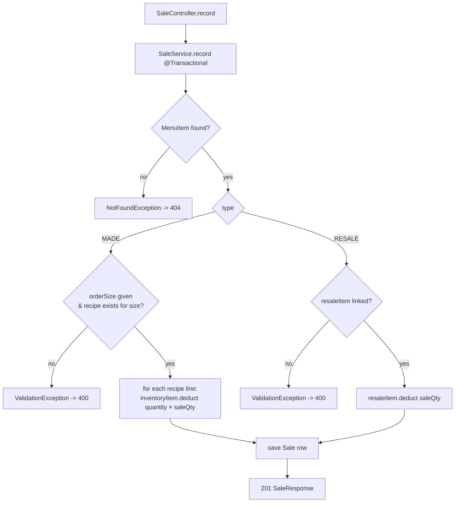

# AROGYA Inventory — Data Flow

How requests move through the layers and how the core flows mutate state. All write flows run inside
a single service `@Transactional` boundary — they fully apply or fully roll back.

## Layering

```
HTTP → Controller (thin, @Valid) → Service (@Transactional, logic) → Repository (Spring Data) → PostgreSQL
                                         │
                                         └── maps entities ⇄ record DTOs; throws domain exceptions
HTTP errors ← GlobalExceptionHandler (@RestControllerAdvice, RFC 7807 ProblemDetail)
```

## Core flow 1 — record a sale (auto-deduction)

`POST /api/sales {menuItemId, orderSize?, quantity}`



- Deduction mutates the managed `InventoryItem` entities (reachable via recipe lines / resale link);
  JPA dirty-checking flushes them in the same transaction — no explicit inventory `save()`.
- `deduct()` has **no zero floor** — stock may go to/below zero; the low-stock list surfaces it.
- Any exception rolls back the whole sale (no partial deduction).

## Core flow 2 — low-stock alert

`GET /api/inventory/low-stock` → `InventoryItemRepository.findLowStock()`
(`where quantity_on_hand <= reorder_threshold`, `left join fetch supplier`) →
`LowStockResponse` includes `supplierId` + `supplierName` so the owner knows whom to reorder from.

## Core flow 3 — manual replenish / correction

`POST /api/inventory/{id}/adjust {delta, reason}` → `InventoryService.adjust`:
adds `delta` (may be negative); rejects with 400 if the result would drop below zero. This is the
only way stock goes up — reordering happens outside the app (alert-only, no purchase orders).

## CRUD flows

Suppliers, inventory items, and menu items follow the standard
create / list / get / update / delete shape; menu additionally exposes `GET/PUT /{id}/recipe`
(MADE only) which replaces all recipe lines for the item.

## Error translation

Domain exceptions never reach the client raw:
- `NotFoundException` → 404, `ValidationException` → 400, both as RFC 7807 `ProblemDetail`.
- Bean-validation failures on `@Valid` DTOs → 400.
