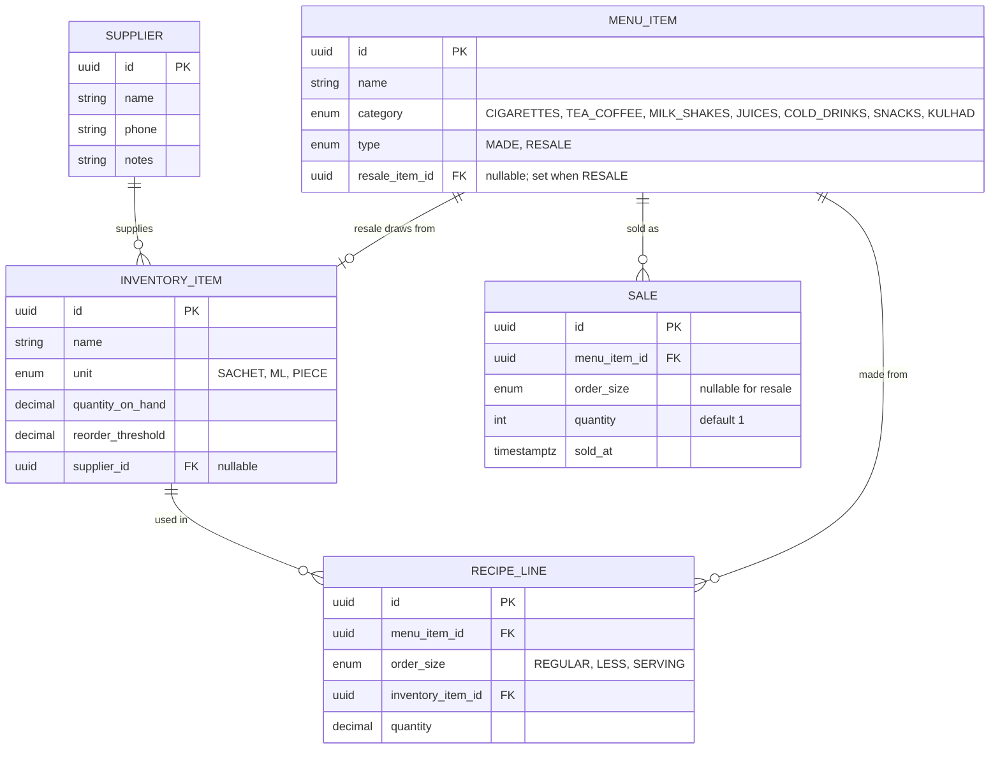

# AROGYA Inventory — Data Model

Source of truth for entities and relationships. Schema is owned by Flyway
(`src/main/resources/db/migration/V1__schema.sql`); JPA maps to it with `ddl-auto: validate`.

## E-R diagram

## Entity notes

- **INVENTORY_ITEM** holds both raw materials (premix → `SACHET`, milk → `ML`, kulhad cup → `PIECE`)
  and resale goods (each cigarette / cold drink / snack → `PIECE`). Quantities are `decimal`
  (milk in ml needs precision). Low-stock predicate: `quantity_on_hand <= reorder_threshold`.
- **MENU_ITEM**
  - `type = MADE` → has `RECIPE_LINE`s keyed by `order_size`; `resale_item_id` is null.
  - `type = RESALE` → `resale_item_id` points at the stock it draws from; no recipe lines.
- **RECIPE_LINE** — one row per (menu item, order size, ingredient). A MADE drink at a given size
  typically has a premix line (1 sachet) plus a milk line (e.g. 180 ml); kulhad items add a cup line.
- **SALE** — append-only event. `order_size` required for MADE, null for RESALE. Recorded even when
  resulting stock goes ≤ 0 (sales are never blocked).

## Java mapping

`com.arogya.<feature>.domain.*` — `Supplier`, `InventoryItem` + `Unit`, `MenuItem` + `RecipeLine` +
`Category`/`MenuType`/`OrderSize`, `Sale`. Entities are never exposed over the wire — `record` DTOs
map in the service layer.

## Seed

`V2__seed.sql` (generated by `scripts/gen_seed.py` from `MENU_AROGYA_Organized.xlsx`): 3 raw +
37 resale inventory items, 66 menu items, 69 recipe lines. `quantity_on_hand` / `reorder_threshold`
default to 0 — the owner sets real levels and suppliers after seeding.
