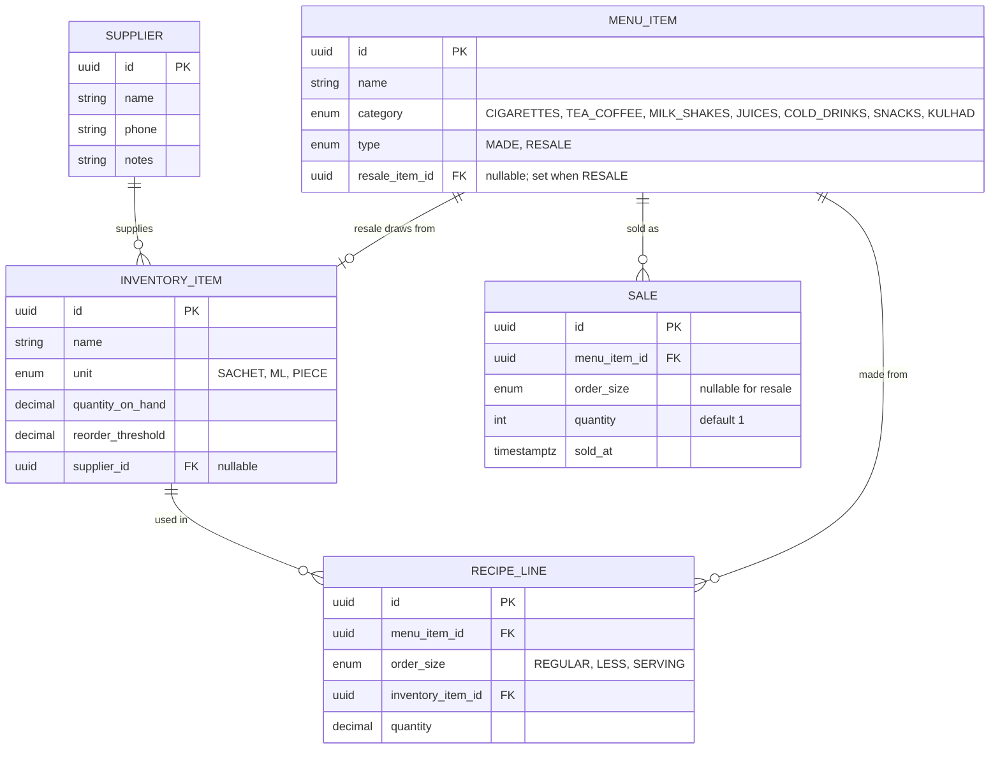

# AROGYA Cafe Inventory — Design Spec

**Date:** 2026-06-21
**Status:** Approved (brainstorm) — ready for implementation plan
**Stack:** Java 21 · Spring Boot 3.x · Gradle · PostgreSQL · Flyway · JUnit 5 + Testcontainers

## 1. Purpose

A backend for the AROGYA cafe/kiosk that tracks ingredient and product stock, automatically
deducts stock as items are sold, and flags ingredients that have run low — showing which supplier
to reorder from. Grounded in `MENU_AROGYA_Organized.xlsx` (76 menu items, recipe guide).

## 2. Scope

**In scope (v1):**
- Suppliers, inventory items, menu items (with recipes), and sales.
- Auto-deduction of stock on each recorded sale (recipe-based for made drinks, one-for-one for resale goods).
- Manual stock adjustment (record deliveries / corrections) — replenishment is manual since reordering is just an alert.
- Low-stock alert list with the supplier for each low item.
- Seed menu + recipes from the spreadsheet.

**Out of scope (v1) — YAGNI:**
- Purchase orders, auto-sending orders to suppliers, supplier integrations (e.g. Domino's-style API).
- Authentication / authorization (single-owner local app; can be added later).
- Reporting/analytics beyond the low-stock list.
- Frontend (this spec is backend only).

## 3. Domain model (unified inventory — "Option A")

**Notes:**
- `INVENTORY_ITEM` holds both raw materials (premix → `SACHET`, milk → `ML`) and resale goods
  (each cigarette brand, cold drink, snack → `PIECE`).
- `MENU_ITEM.type = MADE` → has `RECIPE_LINE`s keyed by `order_size`.
  `type = RESALE` → `resale_item_id` points at the stock it draws from; one unit deducted per sale.
- Low-stock = `quantity_on_hand <= reorder_threshold`.
- Quantities are `decimal` (milk in ml needs precision).

### Order size → milk (from the spreadsheet)
- `REGULAR` ≈ 180 ml milk, `LESS` ("Rs 30 Less") ≈ 120 ml, some items 60 ml; all made drinks use `1 Sachet` premix.
- Resale items have no order size.

## 4. Architecture

Package by feature: `com.arogya.{supplier, inventory, menu, sales}`, each split into
`web / service / domain / repository`.

- Controllers are thin (no logic). Services own logic and `@Transactional`. Repositories are
  Spring Data interfaces.
- JPA entities are never exposed over the wire — `record` request/response DTOs, mapped in the service.
- Errors translated centrally via `@RestControllerAdvice` to RFC 7807 `ProblemDetail`.

## 5. API

**Suppliers** — `/api/suppliers` — full CRUD.

**Inventory** — `/api/inventory`
- CRUD on inventory items.
- `POST /api/inventory/{id}/adjust` — `{ delta, reason }`; record a delivery/correction (manual replenish).
- `GET /api/inventory/low-stock` — items where `quantity_on_hand <= reorder_threshold`, each with supplier.

**Menu** — `/api/menu`
- CRUD on menu items; for `MADE`, manage recipe lines via `GET/PUT /api/menu/{id}/recipe`.

**Sales** — `/api/sales`
- `POST /api/sales` — `{ menuItemId, orderSize?, quantity }`. Core action; in one transaction:
  - `MADE` → deduct each recipe line's `quantity × saleQty` for the given `orderSize`.
  - `RESALE` → deduct `saleQty` from the linked inventory item.
- `GET /api/sales` — recent sales.

## 6. Core behavior decisions

- **Sales are never blocked on low stock.** A sale physically happened, so it is always recorded;
  stock may go to/below zero, and the low-stock list surfaces it. (Chosen over blocking, to match reality.)
- **Deduction is transactional** in the service (`@Transactional`): a multi-ingredient sale fully
  applies or fully rolls back.
- **Replenishment is manual** via the adjust endpoint (goods are ordered outside the app).

## 7. Seeding

A Flyway migration (or one-time loader) seeds from `MENU_AROGYA_Organized.xlsx`:
- Menu items with category and type (`MADE` for Tea & Coffee / Milk & Shakes / Juices / Kulhad;
  `RESALE` for Cigarettes / Cold Drinks / Snacks).
- Recipe lines for made drinks (premix sachet + milk by order size).
- Inventory items for raw materials (premix, milk) and one per resale product.
- Initial `quantity_on_hand` and `reorder_threshold` default to 0 / a sensible default; the owner
  sets real levels and suppliers afterward.

## 8. Error handling

Domain exceptions → `@RestControllerAdvice` → RFC 7807 `ProblemDetail`:
- `NotFound` (404) for unknown supplier / inventory item / menu item / sale.
- `ValidationException` (400) for bad input (negative quantities, unknown order size for a made item,
  missing recipe for the requested order size, resale item with no linked stock).
- Never return raw 500s for expected failures.

## 9. Testing

- **Unit tests** — deduction logic (recipe-based and resale), low-stock predicate, DTO mapping.
- **Slice tests** — repositories (`@DataJpaTest`) incl. the low-stock query; controllers (`@WebMvcTest`).
- **Integration tests** — Testcontainers (PostgreSQL): full sale flow deducts stock and rolls back on
  failure; `low-stock` endpoint returns the right items + suppliers; Flyway migrations apply cleanly.
- Definition of done: `./gradlew test` and the integration suite are green.

## 10. Build order (for the plan)

core/domain → persistence (entities + repos) → Flyway schema + seed → services → controllers/DTOs →
low-stock + sales flows → tests throughout. (Security deferred.)
